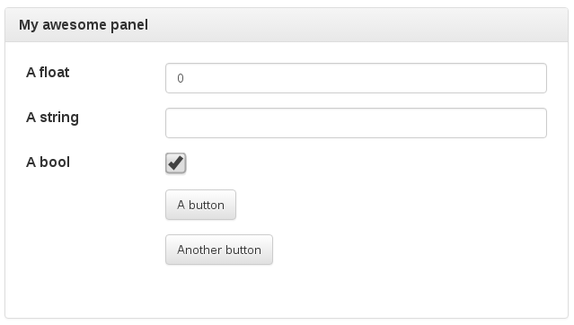

# tunapanel: Autogenerate live Web-based control panels


[API documentation](https://docs.rs/tunapanel)

tunapanel lets you quickly and easily generate a Web-based panel for
controlling the behavior of a running Rust program, locally or over the
network. You simply declare a struct representing all of the panel state, and a
callback for updates.

A simple example, from [`examples/basic.rs`](examples/basic.rs):

```rust
#[macro_use] extern crate serde_derive;
#[macro_use] extern crate tunapanel;

use tunapanel::widget::Button;

tunapanel! {
    #[title = "My awesome panel"]
    #[derive(Debug)]
    struct Panel {
        #[label = "A float"]
        x: f32 = 0.0,

        #[label = "A string"]
        y: String = String::new(),

        #[label = "A bool"]
        b: bool = true,

        #[label = "A button"]
        but1: Button = Button::new(),

        #[label = "Another button"]
        but2: Button = Button::new(),
    }
}

fn main() {
    tunapanel::serve(|p: Panel| {
        println!("Panel update: {:?}", p);
    }).unwrap();
}
```

Build and run this and it will output something like:

```
Listening on 127.0.0.1:1337
```

You can now navigate to `http://127.0.0.1:1337` in your favorite Web browser
and you will see something similar to:



When you modify these form elements, the Rust program receives updates in
realtime.  Here we just print them:

```
Panel update: Panel { x: 0.3, y: "Hello w", b: true, but1: Button(false), but2: Button(false) }
Panel update: Panel { x: 0.3, y: "Hello w", b: true, but1: Button(false), but2: Button(false) }
Panel update: Panel { x: 0.3, y: "Hello wor", b: true, but1: Button(false), but2: Button(false) }
Panel update: Panel { x: 0.3, y: "Hello world", b: true, but1: Button(false), but2: Button(false) }
Panel update: Panel { x: 0.3, y: "Hello world", b: true, but1: Button(false), but2: Button(false) }
Panel update: Panel { x: 0.3, y: "Hello world", b: true, but1: Button(false), but2: Button(false) }
Panel update: Panel { x: 0.3, y: "Hello world!", b: true, but1: Button(false), but2: Button(false) }
Panel update: Panel { x: 0.3, y: "Hello world!", b: true, but1: Button(false), but2: Button(false) }
Panel update: Panel { x: 0.3, y: "Hello world!", b: true, but1: Button(false), but2: Button(false) }
Panel update: Panel { x: 0.3, y: "Hello world!", b: false, but1: Button(false), but2: Button(false) }
Panel update: Panel { x: 0.3, y: "Hello world!", b: false, but1: Button(true), but2: Button(false) }
Panel update: Panel { x: 0.3, y: "Hello world!", b: false, but1: Button(false), but2: Button(true) }
```

If any field fails to parse, the interface will display a "Failure" indication.
You can try again immediately.
